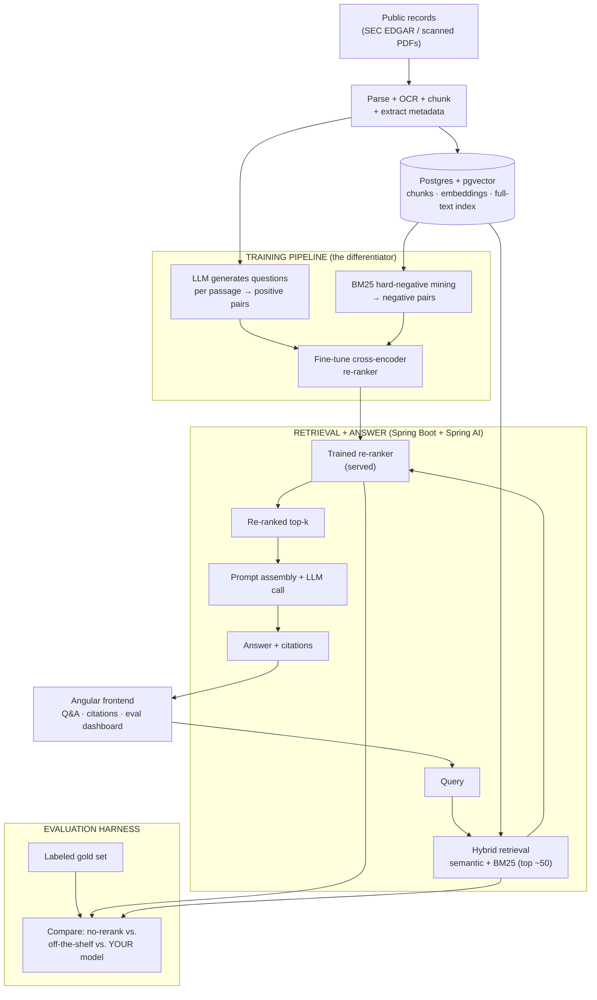

# Provenance — A Trainable Retrieval System for Public Records

A retrieval system that answers natural-language questions over a corpus of public records with **citations back to the exact source passage** — and whose retrieval quality is powered by a **re-ranking model trained in-house, not an off-the-shelf API**.

> **The thesis:** most RAG projects use an LLM as the brain and the developer as the plumbing. Provenance inverts that. An LLM is used only as a *tool to bootstrap training data*; the model that determines answer quality — a fine-tuned cross-encoder re-ranker — is trained, evaluated, and deployed by hand. The system is the showpiece; the trained model is the point.

---

## What makes this different from a typical RAG project

| Typical RAG portfolio project | Provenance |
|---|---|
| LLM does everything; dev wires APIs | Dev trains the model that drives retrieval quality |
| "Chat with a PDF" | A measured retrieval *system* with a trained component |
| Quality judged by eyeballing | Quality proven with nDCG@10 / MRR / recall@k vs. baselines |
| LLM is the centerpiece | LLM is a data-generation tool serving a model you own |

---

## Architecture

Three layers. The middle layer — the trained re-ranker and its training pipeline — is the differentiator.



---

## The trained model

- **Type:** cross-encoder re-ranker, fine-tuned from a small base (e.g. a MiniLM/BERT cross-encoder, ~22M–110M params).
- **Job:** given a question and a candidate passage, output a relevance score. Runs over the ~50 candidates from hybrid retrieval and reorders them so the best passages reach the answer layer.
- **Why it's the right model to train:** load-bearing (re-ranking measurably improves results), small enough to fine-tune on free GPU (Colab/Kaggle), and produces a clean before/after for evaluation.
- **Training data (bootstrapped, not hand-labeled):**
  1. **Positives** — feed each passage to an LLM, have it generate the questions that passage answers.
  2. **Hard negatives** — use BM25 to retrieve passages that look relevant to each question but aren't.
  3. Fine-tune the cross-encoder on these (question, +passage, −passage) triples.
- **Stretch:** also fine-tune the embedding bi-encoder (contrastive learning) so the *first-stage* retrieval is yours too.

---

## Tech Stack

**ML / Training**
- Python, PyTorch, `sentence-transformers` (CrossEncoder API)
- LLM (hosted API or local via Ollama) used **only** for synthetic query generation
- Free GPU: Google Colab / Kaggle (no paid hardware required)
- Export trained model to ONNX for fast serving

**Backend / Orchestration**
- Java 17, Spring Boot 3.2+, Spring AI, Spring Security, REST APIs, Maven

**Retrieval / Data**
- PostgreSQL 16 + `pgvector` (semantic) + full-text search (BM25), fused via Reciprocal Rank Fusion
- Trained re-ranker served as a small Python (FastAPI) service or via ONNX runtime

**Frontend**
- Angular 17+, TypeScript, SCSS

**Cloud & DevOps**
- AWS: RDS (Postgres + pgvector), Elastic Beanstalk, S3, CloudFront
- GitHub Actions CI/CD, Docker

---

## Build Plan

Each phase is ~one focused weekend and ends with something that works. The retrieval *system* (Phases 0–2, 6) plays to existing strengths; the *ML* (Phases 3–5) is the new, rare signal. Build the baseline first so you have something to beat.

| Phase | Goal | You'll have built |
|------|------|-------------------|
| **0 — Scaffold & corpus** | Project skeleton + documents on disk | Monorepo, Postgres+pgvector via Docker, a fetcher pulling public filings |
| **1 — Ingestion** | Documents → clean chunks | Parser w/ OCR fallback, chunking, metadata extraction, populated `chunks` table |
| **2 — Baseline retrieval** | A baseline to beat | Hybrid retrieval (pgvector semantic + Postgres BM25, fused via RRF) |
| **3 — Training data pipeline** ⭐ | A training set you generated | LLM-based synthetic query generation + BM25 hard-negative mining → labeled triples |
| **4 — Train the re-ranker** ⭐ | A model you own | Fine-tuned cross-encoder, exported to ONNX, served and slotted in after hybrid retrieval |
| **5 — Evaluation** ⭐ | Proof it works | Gold set + nDCG@10 / MRR / recall@k comparing no-rerank vs. off-the-shelf vs. your model; end-to-end faithfulness + citation accuracy |
| **6 — Answer layer + frontend + deploy** | A live demo | Grounded cited answers, Angular UI (query, citations, source viewer, eval dashboard), deployed on AWS w/ CI/CD |

### Stretch goals (pick 1–2 for depth)
- Fine-tune the **embedding bi-encoder** (contrastive) so first-stage retrieval is also yours
- **Quantize / distill** the re-ranker for low-latency serving (a production-ML talking point)
- **LoRA** a small model for the metadata-extraction step (ties to document-extraction work)

---

## Evaluation (the proof layer)

1. **Gold set** — ~30–50 questions, each labeled with the passage(s) that should answer it.
2. **Retrieval metrics** — recall@k, MRR, nDCG@10.
3. **The headline comparison** — run the gold set three ways and report the deltas:
   - hybrid retrieval, no re-ranking
   - hybrid + an off-the-shelf re-ranker
   - hybrid + **your fine-tuned re-ranker**
4. **End-to-end** — answer faithfulness (grounded vs. hallucinated) and citation accuracy.

The win condition is a single defensible sentence: *"My fine-tuned re-ranker improved nDCG@10 from X to Y, beating both no-reranking and the off-the-shelf baseline."*

---

## Resume bullets this earns you

- Fine-tuned a cross-encoder re-ranker on **LLM-bootstrapped training data**, improving nDCG@10 by [X]% over off-the-shelf retrieval; served via ONNX in a deployed full-stack system.
- Built a synthetic training-data pipeline (LLM query generation + BM25 hard-negative mining) to train a domain retrieval model without hand-labeling.
- Designed an evaluation harness (recall@k, MRR, nDCG, answer faithfulness) to quantify retrieval quality across model variants.
- Deployed the end-to-end system (Spring Boot + Angular + AWS) with CI/CD.

---

## Running Locally

```bash
# 1. Start Postgres + pgvector
docker compose -f infra/docker-compose.yml up -d db

# 2. Ingest documents
cd ingestion && pip install -r requirements.txt
python ingest.py --source edgar --limit 200

# 3. Build training data + train the re-ranker (or use Colab/Kaggle GPU)
python build_training_data.py        # LLM positives + BM25 hard negatives
python train_reranker.py             # fine-tune + export to ONNX

# 4. Run the re-ranker service, API, and frontend
cd ../reranker && uvicorn app:app --port 8000
cd ../backend && mvn spring-boot:run
cd ../frontend && npm install && ng serve   # http://localhost:4200
```

---

## Project Status

Active development. Phases 0–2 establish the baseline; Phases 3–5 are the ML core; Phase 6 ships it.
